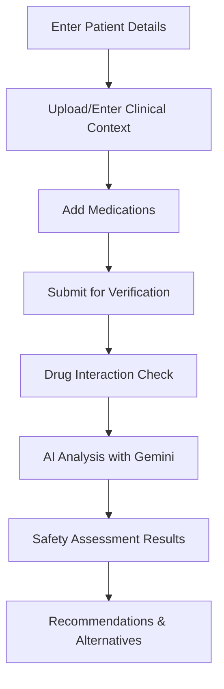
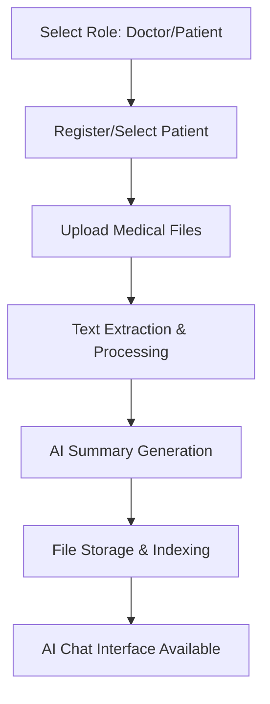

# Medi-Co: AI-Powered Clinical Decision Support System

## 🎯 Project Overview

Medi-Co is an innovative AI-powered clinical decision support system that combines **drug interaction checking**, **prescription verification**, and **medical document management** to enhance healthcare delivery and patient safety. Built for the healthcare ecosystem, it serves both healthcare professionals and patients with intelligent tools for safer medical practices.

## 🌟 Key Features

### 1. **AI Prescription Verifier** 
- Real-time prescription safety analysis using Google Gemini AI
- Comprehensive drug-drug interaction detection
- Age-appropriate dosage validation
- Clinical context-aware recommendations
- Alternative medication suggestions
- Multi-format document upload support (PDF, DOC, TXT)

### 2. **Medical Document Management**
- Secure patient file upload and storage
- AI-powered document analysis and summarization
- Role-based access (Doctor/Patient perspectives)
- Intelligent chat interface for medical queries
- Text extraction from various file formats

### 3. **Drug Interaction Database**
- Extensive DrugBank-based interaction database
- Synonym matching for drug name variations
- REST API for integration with other systems
- Real-time safety assessments

## 🏗️ System Architecture

### Backend (FastAPI)
```
backend/
├── main.py                 # FastAPI application entry point
├── requirements.txt        # Python dependencies
├── patients.db            # SQLite database for patient records
├── dataset/               # Drug interaction datasets
│   ├── data_final_v5.csv     # Main drug interaction data
│   ├── drugs_synonyms.json   # Drug name synonyms
│   └── drug_info.json        # Additional drug information
├── models/
│   └── schemas.py         # Pydantic data models
├── routes/                # API route handlers
│   ├── interactions.py    # Drug interaction endpoints
│   ├── verification.py    # Prescription verification
│   ├── medical_files.py   # File management
│   ├── search.py          # Drug search functionality
│   └── health.py          # Health check endpoint
└── utils/                 # Utility modules
    ├── data_loader.py     # Dataset loading and processing
    └── database.py        # SQLite database operations
```

### Frontend (React + TypeScript)
```
frontend/
├── src/
│   ├── components/        # Reusable UI components
│   │   ├── ui/           # shadcn/ui components
│   │   ├── Layout.tsx    # Main application layout
│   │   └── AppSidebar.tsx # Navigation sidebar
│   ├── pages/            # Application pages
│   │   ├── PrescriptionVerifier.tsx  # Main prescription tool
│   │   ├── PatientDocuments.tsx      # Document management
│   │   └── NotFound.tsx              # 404 page
│   ├── hooks/            # Custom React hooks
│   └── lib/              # Utility functions
├── package.json          # Node.js dependencies
└── vite.config.ts        # Vite configuration
```

## 🔧 Technology Stack

### Backend
- **Framework**: FastAPI (Python)
- **AI Integration**: Google Gemini API
- **Database**: SQLite
- **Data Processing**: Pandas
- **File Processing**: PyPDF2
- **API Documentation**: Swagger/OpenAPI

### Frontend
- **Framework**: React 18 + TypeScript
- **Build Tool**: Vite
- **UI Library**: shadcn/ui + Radix UI
- **Styling**: Tailwind CSS
- **State Management**: React Query (TanStack Query)
- **Routing**: React Router

### Development Tools
- **Package Manager**: npm (Frontend), pip (Backend)
- **Type Safety**: TypeScript, Pydantic
- **Code Quality**: ESLint, FastAPI validation
- **API Testing**: Built-in FastAPI docs

## 🚀 Installation & Setup

### Prerequisites
- Python 3.8+
- Node.js 16+
- Google Gemini API Key

### Backend Setup

1. **Clone the repository**
   ```bash
   git clone <repository-url>
   cd medi-co/backend
   ```

2. **Create virtual environment**
   ```bash
   python -m venv venv
   # Windows
   venv\Scripts\activate
   # Linux/Mac
   source venv/bin/activate
   ```

3. **Install dependencies**
   ```bash
   pip install -r requirements.txt
   ```

4. **Environment configuration**
   Create a `.env` file in the backend directory:
   ```env
   GEMINI_API_KEY=your_google_gemini_api_key_here
   ```

5. **Start the server**
   ```bash
   uvicorn main:app --reload --host 0.0.0.0 --port 8000
   ```

### Frontend Setup

1. **Navigate to frontend directory**
   ```bash
   cd ../frontend
   ```

2. **Install dependencies**
   ```bash
   npm install
   ```

3. **Start development server**
   ```bash
   npm run dev
   ```

### Access Points
- **Frontend**: http://localhost:5173
- **Backend API**: http://localhost:8000
- **API Documentation**: http://localhost:8000/docs

## 📊 API Endpoints

### Drug Interaction Checking
- `POST /api/v1/check-interactions/` - Check drug-drug interactions
- `GET /api/v1/search/` - Search for drugs in database
- `GET /api/v1/stats/` - Get database statistics

### Prescription Verification
- `POST /api/v1/verify-prescription/` - Comprehensive prescription analysis

### Medical File Management
- `POST /api/v1/patients/register` - Register new patient
- `POST /api/v1/patients/{patient_id}/files/upload` - Upload medical files
- `GET /api/v1/patients/{patient_id}/files` - Get patient files
- `POST /api/v1/patients/{patient_id}/summary` - Generate AI summary
- `POST /api/v1/patients/{patient_id}/chat` - Chat with AI about patient

## 🔄 Workflow

### 1. Prescription Verification Workflow


### 2. Medical Document Management Workflow


## 🧠 AI Implementation

### Google Gemini Integration
- **Purpose**: Advanced prescription analysis and medical document processing
- **Features**:
  - Clinical context understanding
  - Drug interaction interpretation
  - Age and gender-specific recommendations
  - Alternative medication suggestions
  - Medical document summarization

### Drug Database Processing
- **DrugBank Dataset**: Comprehensive drug interaction database
- **Synonym Mapping**: Handles various drug name formats
- **Real-time Processing**: Fast interaction checking algorithms

## 🔐 Security & Privacy

- **Data Storage**: Local SQLite database for patient information
- **File Security**: Unique file identifiers and secure storage
- **API Security**: CORS configured for development
- **Privacy**: No sensitive data transmitted to external APIs except for AI processing

## 🎨 User Interface

### Design Principles
- **Medical Theme**: Professional healthcare-focused design
- **Accessibility**: Clear typography and intuitive navigation
- **Responsive**: Works on desktop and mobile devices
- **Role-based**: Different interfaces for doctors and patients

### Key Components
- **Prescription Verifier**: Clean form-based interface with real-time validation
- **Document Manager**: Drag-and-drop file uploads with progress indicators
- **AI Chat**: Conversational interface for medical queries
- **Results Display**: Color-coded safety indicators (Green/Yellow/Red)

## 📈 Performance Features

- **Fast Loading**: Vite-powered frontend with hot reload
- **Efficient Processing**: Pandas-optimized data operations
- **Caching**: Data loaded once at startup for better performance
- **Error Handling**: Comprehensive error management and user feedback

## 🧪 Testing & Development

### Available Scripts

**Frontend**:
```bash
npm run dev          # Development server
npm run build        # Production build
npm run preview      # Preview production build
npm run lint         # Code linting
```

**Backend**:
```bash
uvicorn main:app --reload    # Development server with auto-reload
```

### API Testing
- Use the built-in FastAPI docs at `/docs` for interactive API testing
- All endpoints include proper request/response schemas
- Example requests provided in API documentation

## 🤝 Contributing

1. Fork the repository
2. Create a feature branch (`git checkout -b feature/amazing-feature`)
3. Commit your changes (`git commit -m 'Add amazing feature'`)
4. Push to the branch (`git push origin feature/amazing-feature`)
5. Open a Pull Request

## 📝 Future Enhancements

- [ ] Integration with Hospital Management Systems
- [ ] Multi-language support
- [ ] Advanced ML models for drug interaction prediction
- [ ] Mobile application development
- [ ] Integration with pharmacy systems
- [ ] Advanced analytics and reporting

## 🐛 Known Issues & Limitations

1. **PDF Text Extraction**: Basic PDF processing - complex layouts may need manual input
2. **AI Dependencies**: Requires Google Gemini API key for full functionality
3. **Database Scale**: Current SQLite setup suitable for development/small scale
4. **File Storage**: Local file storage - consider cloud storage for production

## 📞 Support

For questions, issues, or contributions:

1. **Documentation**: Check this README and API docs
2. **Issues**: Create GitHub issues for bugs or feature requests
3. **Development**: Follow the setup instructions for local development

## 📜 License

This project is developed for educational and healthcare improvement purposes. Please ensure compliance with healthcare regulations in your jurisdiction.

---

**Built with ❤️ for safer healthcare practices**